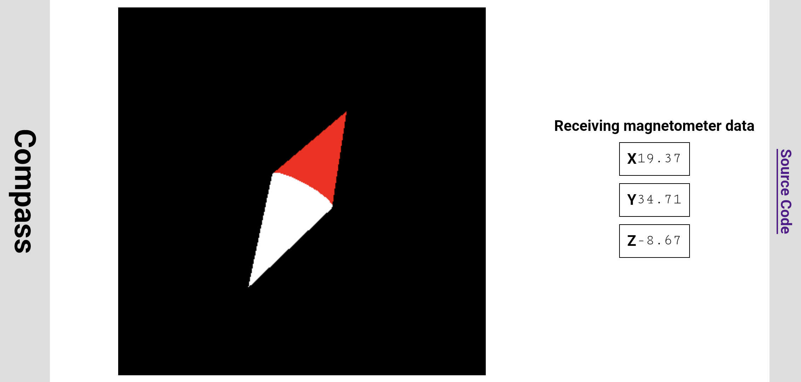

# Compass

This project displays an onscreen compass using data from magnetometer
integrated into mobile phones and similar devices.
[Click here to launch.](https://roger-random.github.io/compass)

This is not intended to be particularly useful. It is more of a practice
exercise in using web APIs and working with the Angular application
framework. It evolved from a very simple
[magnetometer prototype app](https://github.com/Roger-random/nodejs_tests/tree/main/magnetometer).

## Known Problems

* [W3C Magnetometer API](https://w3c.github.io/magnetometer/)
is a work in progress and not finalized, so this app could stop working at
any moment as the preview API evolves.
* Magnetometer preview API in Chrome 112 has an implementation flaw where
its automatic landscape orientation compensation is backwards: Landscape-right
receives data intended for landscape-left, and vice versa. This app has a
workaround where landscape compass is rotated 180 degrees to compensate.
* Vertical text in Chrome 112 is broken and also required workaround.

Tracking issues have been opened for each of the above.

* [Angular](https://angular.io) is big. This web app ended up around 670kB.
~400kB of which is Three.js 3D graphics library, so ~250kB of application
code. It could have been written with a few kilobytes of HTML, CSS, and
JavaScript. But I wanted to learn Angular on something simple.
__Related note__: [Three.js](https://threejs.org/) is even bigger. That ~400kB
was result of Angular build optimization. Without a JavaScript bundler,
downloading the entire Three.js library would be ~1100kB so technically we
came out ahead.

I do not plan to rewrite this app without Angular.

## Project Diary

More details on this project can be found in my online project diary
https://NewScrewdriver.com entries
[tagged with 'Compass'](https://newscrewdriver.com/tag/compass/)
